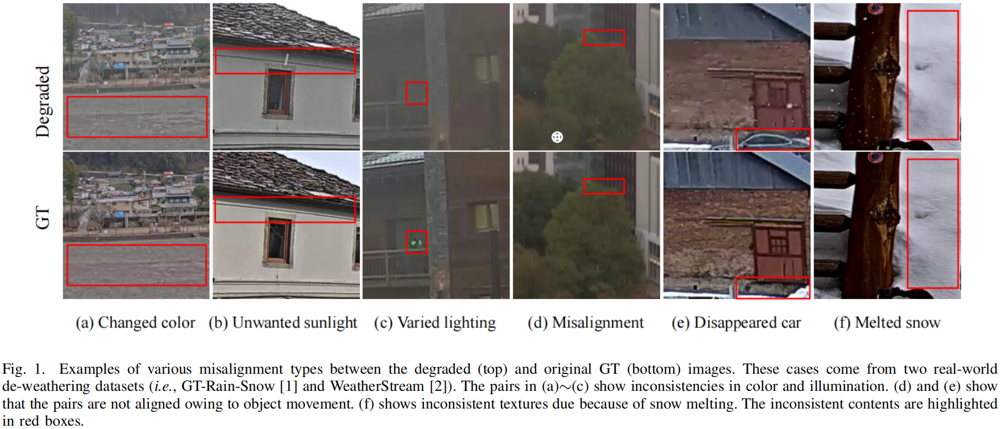

<div align="center">

# Real-World Image De-Weathering under Imperfect Supervision via Spatiotemporal Self-Similarity Aggregation
</div>

This work extends our previous paper presented at AAAI2024 "Learning Real-World Image De-Weathering with Imperfect Supervision" 
[[paper](https://ojs.aaai.org/index.php/AAAI/article/view/28164/28327), 
[code](https://github.com/1180300419/imperfect-deweathering)]

Authors: Heming Xu, Xiaohui Liu

## Overview
<p align="center">
    
</p>
<p align="center">
    

## Architecture
<p align="center">
    
</p>
<p align="center">
    
</p>

## Requirements
- Python 3.8
- CPU or NVIDIA GPU
- pytorch 2.1.2
- CUDA 11.8

## 💾 Datasets
### GT-RAIN
- Publicly Available real-world de-raining dataset
- Download from [here](https://drive.google.com/drive/folders/1NSRl954QPcGIgoyJa_VjQwh_gEaHWPb8)

### WeatherStream
- Publicly Available real-world multi-weather dataset, including rain, snow, and fog
- Download from [here](https://drive.google.com/drive/folders/1O8lTwsFwLftwMIygZS8H-xZAf2f6aL2b?usp=sharing)

## 📎 Pre-trained weights
- Pre-trained weights trained on these two datasets
- Download from [here](https://drive.google.com/drive/folders/1O8lTwsFwLftwMIygZS8H-xZAf2f6aL2b?usp=sharing)

## ⚡️ Testing
- Prepare pre-trained weights
- Run the following code to restore weather degradation
- Average PSNR and SSIM metrics for scenes and different weather types will be automatically computed
```
python test.py
```
## 🤖 Training
- Preparing training set
- Check training set and output weight paths in train.py, then run
```
python train.py
```
## 📌 Citation
If you think our work is useful for your research, please cite our paper by the following.
```bibtex

```